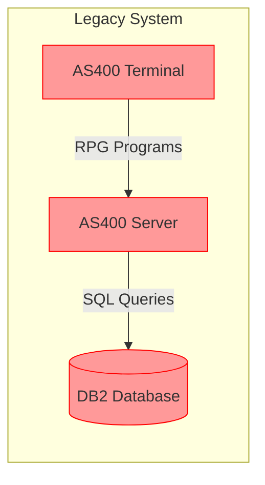
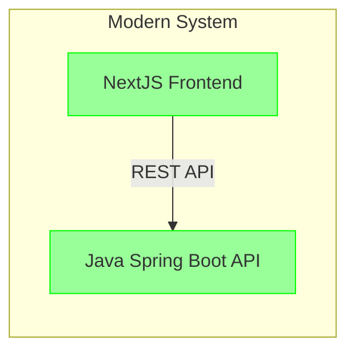

# 🏢 Customer Information Update System

**Modern Web Application with AS400 RPG Integration**

A comprehensive customer management system built with Next.js frontend, .NET Core backend, **Java Spring Boot backend (alternative)**, and IBM AS400 RPG program integration for enterprise-grade data validation.

# System Architecture

## Old System (Legacy)


## New System (Modern)


## Project Structure
```
├── frontend/                 # NextJS Frontend
│   ├── src/                 # Source code
│   │   ├── app/            # NextJS app directory
│   │   └── lib/            # Shared libraries
│   ├── package.json        # Dependencies
│   └── Dockerfile         # Frontend container
│
├── backend/                 # .NET Backend
│   ├── CustomerUpdate.API/  # API Layer (.NET 6)
│   │   ├── Controllers/    # API Controllers
│   │   └── DTOs/          # Data Transfer Objects
│   ├── CustomerUpdate.Core/ # Business Logic
│   └── CustomerUpdate.Infrastructure/ # Data Access
│
├── backend-java/            # Java Spring Boot Backend (NEW)
│   ├── src/                # Java source code
│   ├── pom.xml             # Maven build file
│   ├── Dockerfile          # Java backend container
│   └── README.md           # Java backend usage
│
├── as400/                   # Legacy System
│   ├── rpg/                # RPG Programs
│   └── sql/                # SQL Scripts
│
└── database/               # PostgreSQL Scripts
    └── init.sql           # Database Schema
```

## Technology Stack
### Legacy System
- 🖥️ AS400 Terminal
- 💾 DB2 Database
- 📝 RPG Programs
- 📊 SQL Queries

### Modern System
- ⚛️ NextJS Frontend
- 🎯 .NET 6 API
- ☕ **Java Spring Boot API (alternative backend)**
- 🔄 Entity Framework Core / Spring Data JPA
- 🐘 PostgreSQL Database / H2 (Java dev)
- 📦 NuGet Packages / Maven Dependencies
- 🐳 Docker Containers

## System Comparison

| Component | Old System | New System |
|-----------|------------|------------|
| Frontend | AS400 Terminal | NextJS |
| Backend | AS400 RPG Programs | .NET 6 API |
| Database | DB2 | PostgreSQL |
| User Interface | Text-based Terminal | Modern Web UI |
| Development | RPG/SQL | TypeScript/C# |
| Build Tools | AS400 Tools | Docker Compose | 

## 🎯 Overview
Legacy Interface (Old UI)
The images below showcase the legacy AS400 green-screen interface, which was previously used for customer information updates. This interface, while functional, lacked modern user experience (UX) standards and was not optimized for web or mobile 


Modern Web Interface (New UI)
The new interface is a fully modernized web frontend built with Next.js and Tailwind CSS, offering a responsive, accessible, and user-friendly experience. It seamlessly integrates with the backend API and AS400 system for data validation and persistence.


This system allows users to update customer information through a modern web interface while leveraging legacy AS400 RPG programs for business rule validation. Customer data is validated by the RPG program `MUSTVALID` on AS400 and stored in DB2 database.

## 🏗️ Architecture

```
┌─────────────────┐    ┌─────────────────┐    ┌─────────────────┐
│   Next.js       │    │                 │    │   AS400/IBM i   │
│   Frontend      │───▶│   Backend API   │───▶│   RPG Programs  │
│   (React/TypeScript)│ │   (Java,C#)          │    │   (MUSTVALID)   │
└─────────────────┘    └─────────────────┘    └─────────────────┘
                                 │
                        ┌─────────────────┐
                        │   PostgreSQL    │
                        │   Database      │
                        │   (Docker)      │
                        └─────────────────┘
```

## 🚀 Quick Start with Docker

### Prerequisites
- Docker Desktop
- Docker Compose
- 4GB+ RAM available for containers

### 1. Development Deployment (Mock AS400)
```bash
# Clone the repository
git clone [your-repo-url]
cd customer-update-system

# Build and start all services
./scripts/build.sh

# Access the application
# Frontend: http://localhost:3000
# Backend API: http://localhost:5001
# API Documentation: http://localhost:5001/swagger
```

### 2. Production Deployment (Real AS400)
```bash
# Configure and deploy with real AS400 connection
./scripts/deploy-with-as400.sh

# Follow prompts to enter AS400 credentials:
# - AS400 System Name/IP
# - User ID
# - Password  
# - Libraries (CUSTLIB,CUSTDATA,CUSTLOG)
```

### Java Spring Boot Backend (Docker)
```bash
cd backend-java
mvn clean package
# Build Docker image
docker build -t customerupdate-backend-java .
# Run container
docker run -p 8080:8080 customerupdate-backend-java
# API available at: http://localhost:8080
```

## 🔧 Development Setup

### Local Development (without Docker)

#### Backend (.NET Core)
```bash
cd backend/CustomerUpdate.API
dotnet restore
dotnet run
# API available at: http://localhost:5001
```

#### Backend (Java Spring Boot)
```bash
cd backend-java
mvn clean install
mvn spring-boot:run
# API available at: http://localhost:8080

# H2 Database Console
# http://localhost:8080/h2-console
# JDBC URL: jdbc:h2:mem:customerdb
# User: sa (no password)
```

#### Frontend (Next.js)
```bash
cd frontend
npm install
npm run dev
# App available at: http://localhost:3000
```

## 🏭 Production Configuration

### AS400 Integration

#### RPG Program Requirements
Ensure the following RPG program exists on your AS400:
- **Program**: `CUSTLIB.MUSTVALID`
- **Purpose**: Customer data validation
- **Parameters**: Name, Phone, Email, Address, Tax ID, Result

#### Database Tables (DB2 on AS400)
```sql
-- Main customer table
CUSTDATA.CUSTOMER
- CUSTID (Primary Key)
- CUSTNAME, PHONE, EMAIL, ADDRESS, TAXID
- CREATED_TS, UPDATED_TS, STATUS

-- Validation staging table  
CUSTDATA.CUSTOMER_TEMP
- TEMPID (Primary Key)
- Customer data fields
- ERROR_MSG, STATUS, PROCESSED_TS

-- Audit log table
CUSTLOG.CUSTOMER_LOG
- LOGID (Primary Key)
- CUSTID, ACTION, OLD_VALUES, NEW_VALUES
- USER_ID, LOG_TS, SUCCESS_FLAG
```

#### ODBC Configuration
The system requires IBM i Access ODBC Driver:
```ini
[AS400_ODBC]
Driver=IBM i Access ODBC Driver
System=YOUR-AS400-SYSTEM-NAME
UserID=APIUSER
Password=YOUR-PASSWORD
DefaultLibraries=CUSTLIB,CUSTDATA,CUSTLOG
CommitMode=2
ExtendedDynamic=1
```

### Environment Variables

#### Development (.env.development)
```bash
AS400_USE_REAL_CONNECTION=false
ASPNETCORE_ENVIRONMENT=Development
DATABASE_TYPE=InMemory
```

#### Production (.env.production)
```bash
AS400_USE_REAL_CONNECTION=true
AS400_SYSTEM_NAME=your-as400-system
AS400_USER_ID=apiuser
AS400_PASSWORD=secure-password
AS400_DEFAULT_LIBRARIES=CUSTLIB,CUSTDATA,CUSTLOG
ASPNETCORE_ENVIRONMENT=Production
DATABASE_TYPE=PostgreSQL
```

## 🔐 Security

### AS400 Security
- Dedicated user profile for API access
- Limited object authorities
- Encrypted password storage
- Connection pooling and timeout management

### Application Security
- CORS configuration for allowed origins
- Input validation on frontend and backend
- SQL injection prevention
- Audit logging for all operations

## 📊 Features

### Customer Management
- ✅ Create new customers with AS400 validation
- ✅ Update existing customer information
- ✅ Delete customer records
- ✅ Search and filter customers
- ✅ Export customer data to CSV

### AS400 Integration
- ✅ Real-time RPG program execution
- ✅ Business rule validation in AS400
- ✅ DB2 database operations
- ✅ Comprehensive error handling
- ✅ Audit trail in AS400 logs

### Business Rules (RPG Validation)
- **Name**: 2-100 characters, letters only
- **Phone**: Optional, 10+ digits with formatting
- **Email**: Optional, valid email format
- **Address**: Required, 5-255 characters
- **Tax ID**: Required, 11 digits, unique

### User Interface
- 📱 Responsive design (mobile-friendly)
- 🎨 Modern UI with Tailwind CSS
- ⚡ Real-time validation feedback
- 📊 Dashboard with statistics
- 🔍 Advanced search and filtering

## 🛠️ Technology Stack

### Frontend
- **Framework**: Next.js 14 (React 18)
- **Language**: TypeScript
- **Styling**: Tailwind CSS
- **Forms**: React Hook Form + Zod validation
- **UI Components**: Lucide React icons
- **State Management**: React hooks

### Backend
- **Framework**: .NET Core 6.0 **veya** Java Spring Boot 3+
- **Architecture**: Clean Architecture (her iki backend için)
- **Database**: PostgreSQL (production) / InMemory (development) / H2 (Java dev)
- **ORM**: Entity Framework Core (.NET) / Spring Data JPA (Java)
- **Validation**: FluentValidation (.NET) / Jakarta Validation (Java)
- **Logging**: Serilog (.NET) / Spring Boot Logging (Java)
- **Documentation**: Swagger/OpenAPI

### AS400 Integration
- **System**: IBM AS400/IBM i
- **Language**: RPG ILE
- **Database**: IBM DB2 for i
- **Connectivity**: ODBC
- **Programs**: MUSTVALID (validation), CUSTUTIL (utilities)

### Infrastructure
- **Containerization**: Docker & Docker Compose
- **Database**: PostgreSQL 15
- **Caching**: Redis (optional)
- **Reverse Proxy**: Nginx (optional)
- **Deployment**: Multi-stage Docker builds

## 📋 API Endpoints

### Customer Operations
```http
GET    /api/customers              # Get all customers
GET    /api/customers/{id}         # Get customer by ID  
POST   /api/customers              # Create new customer (with AS400 validation)
PUT    /api/customers/{id}         # Update customer
DELETE /api/customers/{id}         # Delete customer
GET    /api/customers/validate-tax-id/{taxId}  # Validate Tax ID uniqueness
```

### System Health
```http
GET    /api/health                 # System health check
```

### Sample Request (Create Customer)
```json
POST /api/customers
Content-Type: application/json

{
  "name": "Ahmet Yılmaz",
  "phone": "(555) 123-4567",
  "email": "ahmet.yilmaz@example.com", 
  "address": "Atatürk Caddesi No:123 Ankara",
  "taxId": "12345678901"
}
```

### Sample Response (Success)
```json
{
  "success": true,
  "message": "SUCCESS: Customer information validated and saved successfully. Customer ID: 1001",
  "data": {
    "customerId": 1001,
    "name": "Ahmet Yılmaz",
    "phone": "(555) 123-4567",
    "email": "ahmet.yilmaz@example.com",
    "address": "Atatürk Caddesi No:123 Ankara", 
    "taxId": "12345678901",
    "status": "Active",
    "createdAt": "2024-01-15T10:30:00Z",
    "updatedAt": "2024-01-15T10:30:00Z"
  }
}
```

### Sample Response (Validation Error)
```json
{
  "success": false,
  "message": "VALIDATION_ERROR: Customer name must be 2-100 characters. Tax ID already exists in database.",
  "errors": [
    "Customer name must be 2-100 characters",
    "Tax ID already exists in database"
  ]
}
```

## 🔧 Development Commands

### Docker Commands
```bash
# Start development environment
./scripts/build.sh

# Deploy production with AS400
./scripts/deploy-with-as400.sh

# View logs
docker-compose logs -f [service-name]

# Stop all services  
docker-compose down

# Rebuild specific service
docker-compose up --build [service-name]

# Database shell access
docker-compose exec database psql -U admin -d customerdb
```

### Backend Commands
```bash
cd backend/CustomerUpdate.API

# Run in development
dotnet run

# Run tests
dotnet test

# Build for production
dotnet publish -c Release

# Entity Framework migrations
dotnet ef migrations add [MigrationName]
dotnet ef database update
```

### Frontend Commands
```bash
cd frontend

# Development server
npm run dev

# Production build
npm run build
npm start

# Lint and format
npm run lint
npm run format

# Type checking
npm run type-check
```

## 🧪 Testing

### AS400 Mock Testing
The system includes a comprehensive mock AS400 service that simulates the RPG program behavior:
- Validates all business rules
- Returns proper error messages
- Simulates database operations
- Maintains Tax ID uniqueness

### Integration Testing
```bash
# Test customer creation with mock AS400
curl -X POST "http://localhost:5001/api/customers" \
  -H "Content-Type: application/json" \
  -d '{
    "name": "Test Customer",
    "phone": "(555) 123-4567",
    "email": "test@example.com",
    "address": "Test Address 123",
    "taxId": "12345678901"
  }'
```

## 📈 Monitoring & Maintenance

### Health Checks
- Backend API: `http://localhost:5001/api/health`
- Frontend: `http://localhost:3000`
- Database: `docker-compose exec database pg_isready`

### Log Monitoring
```bash
# Application logs
docker-compose logs -f backend
docker-compose logs -f frontend

# Database logs  
docker-compose logs -f database

# AS400 validation logs
docker-compose logs -f backend | grep "AS400"
```

### Performance Metrics
- AS400 RPG program execution time
- Database query performance
- API response times
- Frontend loading metrics

## 🚨 Troubleshooting

### Common Issues

#### AS400 Connection Failed
```bash
# Check ODBC configuration
docker-compose exec backend cat /etc/odbc.ini

# Test AS400 connectivity
telnet your-as400-system 23

# Verify credentials
# Check AS400 user profile authorities
```

#### Database Connection Issues
```bash
# Check database status
docker-compose ps database

# Check database logs
docker-compose logs database

# Connect to database
docker-compose exec database psql -U admin -d customerdb
```

#### Frontend Build Issues
```bash
# Clear Node modules and rebuild
cd frontend
rm -rf node_modules package-lock.json
npm install
npm run build
```

### Support Contacts
- **AS400 Issues**: System Administrator
- **Application Issues**: Development Team
- **Infrastructure Issues**: DevOps Team

## 📄 License

This project is proprietary software for internal enterprise use.

---

**Built with ❤️ for modern enterprise integration** 

## 🆕 Java Spring Boot Backend Desteği
- Projeye alternatif olarak Java Spring Boot backend desteği eklenmiştir.
- Tüm API endpoint'leri ve iş kuralları Java backend'de de mevcuttur.
- H2 veritabanı ile hızlı geliştirme ve test imkanı sağlar.
- Docker ile kolayca container olarak çalıştırılabilir.
- AS400 entegrasyonu için stub servis hazırdır, gerçek ODBC bağlantısı eklenebilir.
