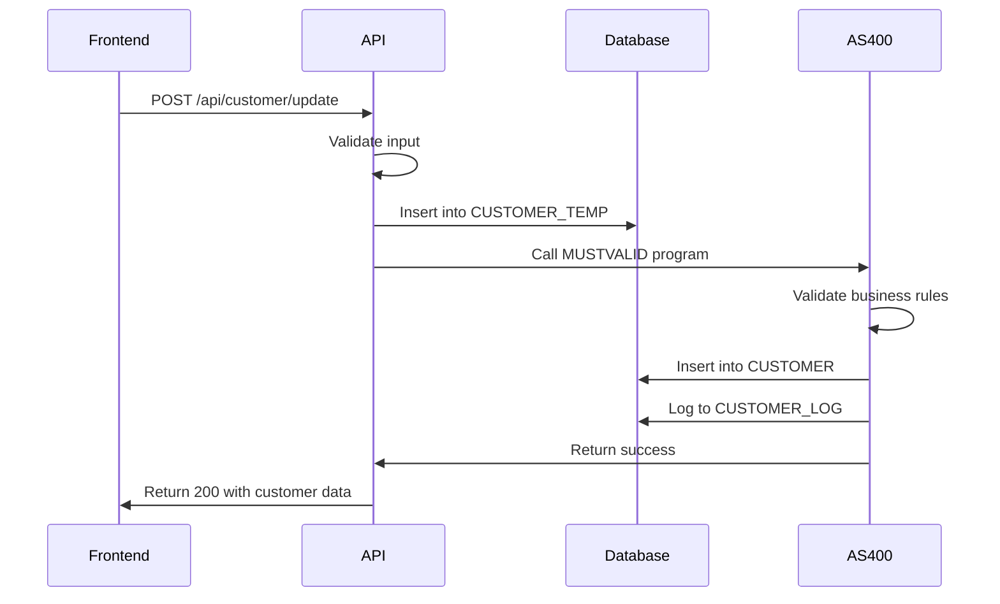
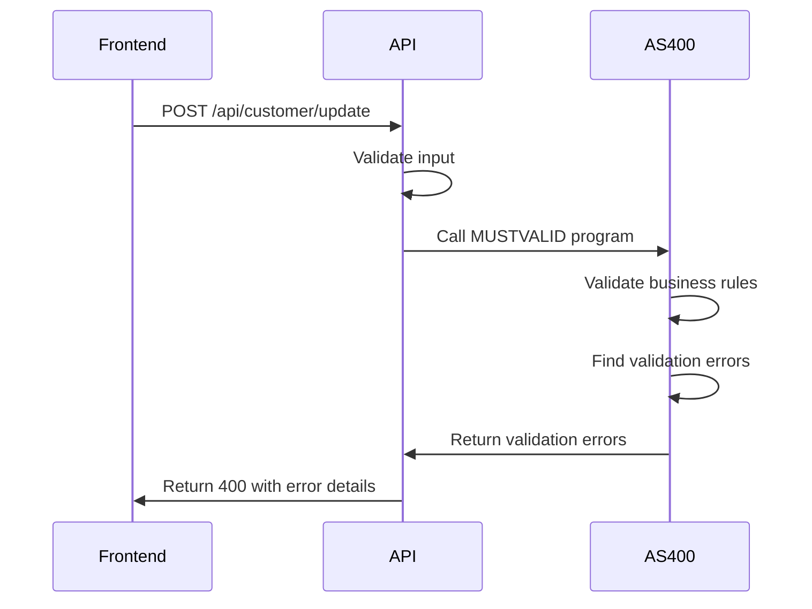

# Customer Update API Specification

📋 **RESTful API Documentation for Customer Information Management System**

## 🎯 Overview

This document describes the REST API endpoints for the Customer Information Update System. The API facilitates communication between the Next.js frontend and the AS400 backend through a .NET Core Web API.

## 📍 Base URL

```
Development: http://localhost:5000
Production:  https://api.customer-update.company.com
```

## 🔒 Authentication

Currently, the API uses basic authentication. Future versions will implement OAuth 2.0.

```http
Authorization: Basic base64(username:password)
```

## 📝 API Endpoints

### 1. Customer Management

#### 1.1 Update Customer Information

**POST** `/api/customer/update`

Updates customer information with AS400 validation.

**Request Headers:**
```http
Content-Type: application/json
Authorization: Basic <credentials>
```

**Request Body:**
```json
{
  "name": "John Doe",
  "phone": "(555) 123-4567",
  "email": "john.doe@example.com", 
  "address": "123 Main Street, Anytown, ST 12345",
  "taxId": "12345678901"
}
```

**Response (Success):**
```http
HTTP/1.1 200 OK
Content-Type: application/json
```
```json
{
  "success": true,
  "message": "Customer information updated successfully",
  "data": {
    "customerId": 1001,
    "name": "John Doe",
    "phone": "(555) 123-4567",
    "email": "john.doe@example.com",
    "address": "123 Main Street, Anytown, ST 12345",
    "taxId": "12345678901",
    "updatedAt": "2024-01-15T10:30:00Z"
  }
}
```

**Response (Validation Error):**
```http
HTTP/1.1 400 Bad Request
Content-Type: application/json
```
```json
{
  "success": false,
  "message": "Validation failed",
  "errors": [
    {
      "field": "email",
      "message": "Invalid email format"
    },
    {
      "field": "taxId", 
      "message": "Tax ID must be exactly 11 digits"
    }
  ]
}
```

**Response (AS400 Error):**
```http
HTTP/1.1 422 Unprocessable Entity
Content-Type: application/json
```
```json
{
  "success": false,
  "message": "AS400 validation failed",
  "error": "Tax ID already exists in database",
  "code": "DUPLICATE_TAXID"
}
```

#### 1.2 Get Customer by ID

**GET** `/api/customer/{id}`

Retrieves customer information by customer ID.

**Path Parameters:**
- `id` (integer): Customer ID

**Response (Success):**
```http
HTTP/1.1 200 OK
Content-Type: application/json
```
```json
{
  "success": true,
  "data": {
    "customerId": 1001,
    "name": "John Doe",
    "phone": "(555) 123-4567",
    "email": "john.doe@example.com",
    "address": "123 Main Street, Anytown, ST 12345",
    "taxId": "12345678901",
    "createdAt": "2024-01-10T09:00:00Z",
    "updatedAt": "2024-01-15T10:30:00Z"
  }
}
```

**Response (Not Found):**
```http
HTTP/1.1 404 Not Found
Content-Type: application/json
```
```json
{
  "success": false,
  "message": "Customer not found",
  "error": "No customer found with ID 1001"
}
```

#### 1.3 Get Customer by Tax ID

**GET** `/api/customer/tax-id/{taxId}`

Retrieves customer information by Tax ID.

**Path Parameters:**
- `taxId` (string): 11-digit Tax ID

**Response:** Same as Get Customer by ID

#### 1.4 Validate Customer Data

**POST** `/api/customer/validate`

Validates customer data without saving to database.

**Request Body:** Same as Update Customer Information

**Response (Valid):**
```http
HTTP/1.1 200 OK
Content-Type: application/json
```
```json
{
  "success": true,
  "message": "Customer data is valid",
  "validationResults": {
    "name": { "isValid": true },
    "phone": { "isValid": true },
    "email": { "isValid": true },
    "address": { "isValid": true },
    "taxId": { "isValid": true, "isDuplicate": false }
  }
}
```

**Response (Invalid):**
```http
HTTP/1.1 400 Bad Request
Content-Type: application/json
```
```json
{
  "success": false,
  "message": "Validation failed",
  "validationResults": {
    "name": { "isValid": true },
    "phone": { "isValid": false, "error": "Phone number contains invalid characters" },
    "email": { "isValid": false, "error": "Invalid email format" },
    "address": { "isValid": true },
    "taxId": { "isValid": true, "isDuplicate": true, "error": "Tax ID already exists" }
  }
}
```

### 2. Health & Monitoring

#### 2.1 API Health Check

**GET** `/health`

Returns overall API health status.

**Response (Healthy):**
```http
HTTP/1.1 200 OK
Content-Type: application/json
```
```json
{
  "status": "Healthy",
  "checks": {
    "database": "Healthy",
    "as400": "Healthy"
  },
  "duration": "00:00:00.0123456",
  "timestamp": "2024-01-15T10:30:00Z"
}
```

**Response (Unhealthy):**
```http
HTTP/1.1 503 Service Unavailable
Content-Type: application/json
```
```json
{
  "status": "Unhealthy",
  "checks": {
    "database": "Healthy",
    "as400": "Unhealthy"
  },
  "errors": [
    "AS400 connection timeout"
  ],
  "duration": "00:00:05.0000000",
  "timestamp": "2024-01-15T10:30:00Z"
}
```

#### 2.2 Database Health Check

**GET** `/health/db`

Returns database connectivity status.

**Response:**
```json
{
  "status": "Healthy",
  "database": "Connected",
  "responseTime": "00:00:00.0050000",
  "recordCount": {
    "customers": 1250,
    "customerTemp": 5,
    "customerLog": 3847
  }
}
```

#### 2.3 AS400 Health Check

**GET** `/health/as400`

Returns AS400 connectivity and RPG program status.

**Response:**
```json
{
  "status": "Healthy", 
  "as400Connection": "Connected",
  "rpgProgram": "Available",
  "responseTime": "00:00:00.1200000",
  "lastSuccessfulCall": "2024-01-15T10:25:00Z"
}
```

### 3. System Information

#### 3.1 API Version

**GET** `/api/version`

Returns API version and build information.

**Response:**
```http
HTTP/1.1 200 OK
Content-Type: application/json
```
```json
{
  "version": "1.0.0",
  "buildDate": "2024-01-15T08:00:00Z",
  "environment": "Production",
  "dotnetVersion": "8.0.0",
  "features": [
    "CustomerUpdate",
    "AS400Integration", 
    "HealthChecks",
    "Logging"
  ]
}
```

## 🔍 Data Models

### Customer Model

```typescript
interface Customer {
  customerId?: number;
  name: string;
  phone?: string;
  email?: string;
  address: string;
  taxId: string;
  createdAt?: string;
  updatedAt?: string;
}
```

### API Response Model

```typescript
interface ApiResponse<T = any> {
  success: boolean;
  message: string;
  data?: T;
  errors?: ValidationError[];
  error?: string;
  code?: string;
}
```

### Validation Error Model

```typescript
interface ValidationError {
  field: string;
  message: string;
  code?: string;
}
```

### Health Check Model

```typescript
interface HealthCheckResponse {
  status: 'Healthy' | 'Degraded' | 'Unhealthy';
  checks: Record<string, string>;
  errors?: string[];
  duration: string;
  timestamp: string;
}
```

## 🚨 Error Codes

| Code | Description | HTTP Status |
|------|-------------|-------------|
| `VALIDATION_ERROR` | Input validation failed | 400 |
| `DUPLICATE_TAXID` | Tax ID already exists | 422 |
| `AS400_CONNECTION_ERROR` | AS400 system unavailable | 503 |
| `AS400_PROGRAM_ERROR` | RPG program execution failed | 500 |
| `DATABASE_ERROR` | Database operation failed | 500 |
| `CUSTOMER_NOT_FOUND` | Customer does not exist | 404 |
| `UNAUTHORIZED` | Authentication required | 401 |
| `FORBIDDEN` | Insufficient permissions | 403 |
| `RATE_LIMITED` | Too many requests | 429 |

## 🔄 Request/Response Flow

### Successful Update Flow



### Validation Error Flow



## 🧪 Testing

### Example cURL Commands

#### Update Customer
```bash
curl -X POST http://localhost:5000/api/customer/update \
  -H "Content-Type: application/json" \
  -H "Authorization: Basic dXNlcjpwYXNz" \
  -d '{
    "name": "John Doe",
    "phone": "(555) 123-4567", 
    "email": "john.doe@example.com",
    "address": "123 Main St, Anytown ST 12345",
    "taxId": "12345678901"
  }'
```

#### Get Customer
```bash
curl -X GET http://localhost:5000/api/customer/1001 \
  -H "Authorization: Basic dXNlcjpwYXNz"
```

#### Health Check
```bash
curl -X GET http://localhost:5000/health
```

### Postman Collection

A complete Postman collection is available at:
```
./docs/postman/Customer-Update-API.postman_collection.json
```

## 📊 Rate Limiting

The API implements rate limiting to prevent abuse:

- **General endpoints**: 100 requests per minute per IP
- **Update operations**: 10 requests per minute per IP
- **Health checks**: Unlimited

Rate limit headers are included in responses:
```http
X-RateLimit-Limit: 100
X-RateLimit-Remaining: 95
X-RateLimit-Reset: 1642248000
```

## 🔒 Security Considerations

1. **Input Validation**: All inputs are validated on both client and server
2. **SQL Injection**: Parameterized queries prevent SQL injection
3. **XSS Prevention**: Output encoding prevents cross-site scripting
4. **CORS**: Configured to allow only trusted origins
5. **HTTPS**: All production traffic uses TLS 1.2+
6. **Audit Logging**: All operations are logged for security monitoring

## 📈 Performance

### Response Time Targets

- **GET requests**: < 200ms
- **POST requests**: < 500ms  
- **AS400 validation**: < 1000ms
- **Health checks**: < 100ms

### Caching Strategy

- Customer data: Cached for 5 minutes
- Validation rules: Cached for 1 hour
- Health status: Cached for 30 seconds

## 🔗 Related Documentation

- [Frontend Integration Guide](../frontend/README.md)
- [AS400 Integration Details](../as400/README.md)
- [Database Schema](./database-schema.md)
- [Deployment Guide](./deployment-guide.md)

---

**API Version**: 1.0.0  
**Last Updated**: January 15, 2024  
**Swagger Documentation**: http://localhost:5000/swagger 